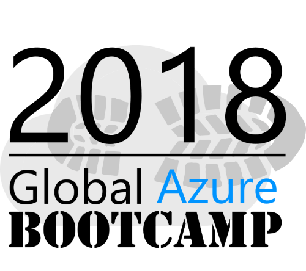

# Azure Bootcamp - Asp.Net Core & DevOps

All around the world user groups and communities want to learn about Azure and Cloud Computing!

On **April 21, 2018**, Estonian community will come together for the next Azure Bootcamp event!

You will find included in this repository all hands on labs and materials that will be used during the demos and available as hands-on-labs so you can try it at the event and later at home.

## Our speakers for the Azure Bootcamp - HOLs for Asp.Net Core & DevOps 2017

- Taavi Koosaar (@melborp)
- Gunnar Peipmann
- Madis Koosaar

You can find the complete shedule [here](./Schedule.md).

## Technology Stack for the Azure Bootcamp Asp.Net Core & DevOps 2017

- [ASP.NET Core (MVC)](https://www.asp.net/core)
- [Azure Web APP](https://azure.microsoft.com/en-ca/services/app-service/web/)
- [Entity Framework Core](https://docs.microsoft.com/en-us/ef/#pivot=efcore)
- [Azure SQL Database](https://azure.microsoft.com/en-us/services/sql-database/)
- [Azure Resource Manager](https://docs.microsoft.com/en-us/azure/azure-resource-manager/resource-group-overview)
- [Azure Functions](https://azure.microsoft.com/en-us/services/functions/)
- [Azure Application Insights](https://azure.microsoft.com/en-us/services/application-insights/)
- [Visual Studio Team Services)](https://www.visualstudio.com/team-services/)

## What you will need before the bootcamp?
We will use computer class at Tallinn Polytechnic with the required Software, so you will need positive energy and passion to join and go through the HOLs. 

### Azure subscription
If you don't own an Azure subscription already, you can create your free account today. It comes with 200$ credit, so you can experience almost everything without spending a dime.

Make sure to have your account up and ready before the bootcamp.

[Create your free Azure account today](https://azure.microsoft.com/en-us/free/)

### Visual Studio
To use the demo code, you are required to install Microsoft Visual studio. The minimum version of Visual Studio to use with the demo code is 2017 version 15.6.5. [You can download a free trial of Visual Studio here](https://www.visualstudio.com/en-us/news/releasenotes/vs2017-relnotes)

Visual Studio 2017 introduce the new installation experience. You can use it to customize your installation by selecting the feature sets or workloads that you want. Select ASP.NET and Web development and select Azure development. 

![img1][img1]

### Azure SDK - 3.0 or later
If during installation you didn't select Azure development Workload, make sure you have installed [Microsoft Azure SDK for .NET - 3.0](https://www.microsoft.com/en-us/download/details.aspx?id=54917)

### .NET Core - 2.1.105 SDK
If during installation you didn't select ASP.NET and Web development Workload, make sure you have installed [.NET Core SDK - 2.1.105](https://www.microsoft.com/net/download/windows)

### Azure PowerShell - 5.6 or later
Make sure you have installed [Azure PowerShell v5.6.0](https://github.com/Azure/azure-powershell/releases/tag/v5.6.0-March2018) or later.

### Git
Make sure to have Git installed. You can have nice GUI but the console is the only requirement. you can pick the version for your OS on [Git](https://git-scm.com/downloads)

## End