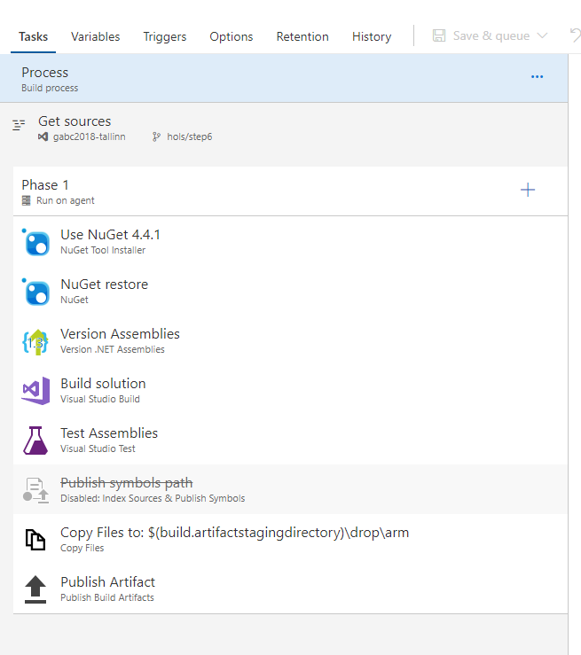
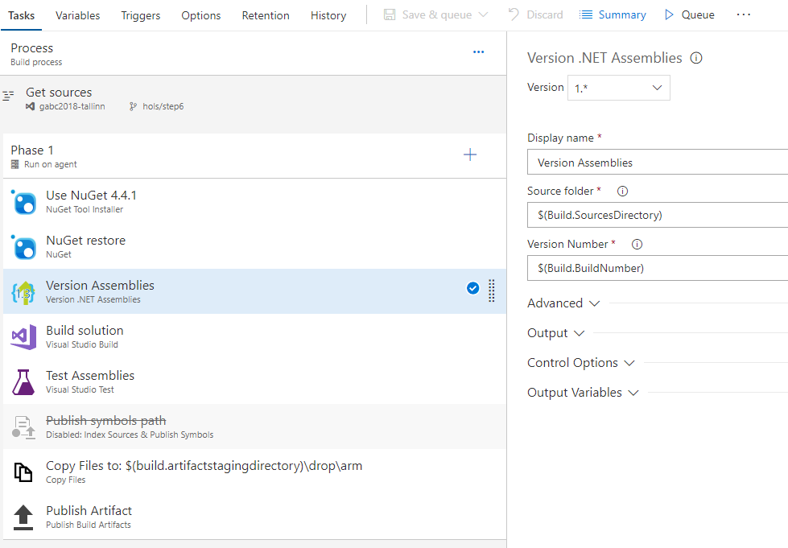
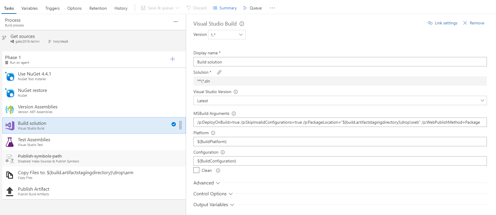
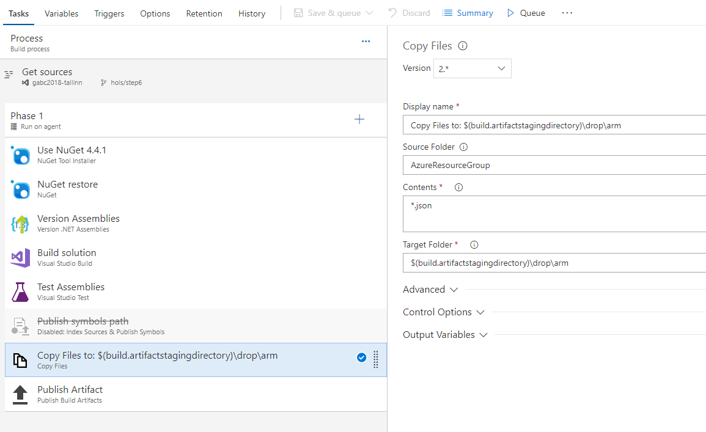
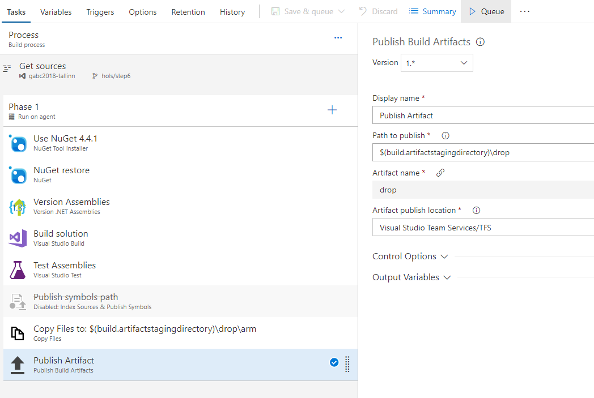
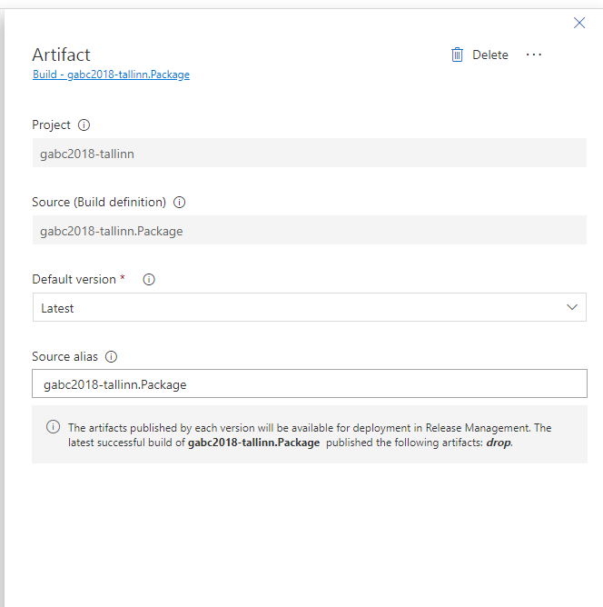
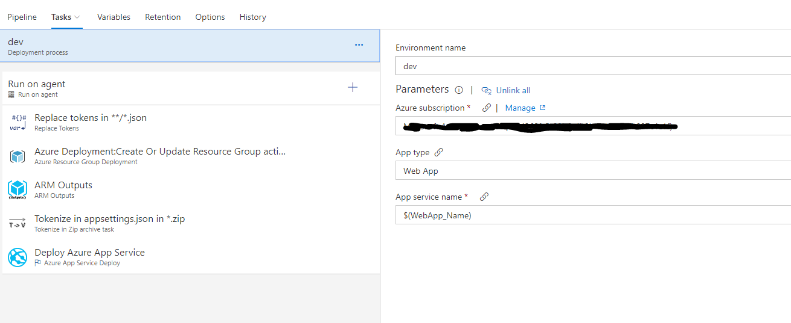
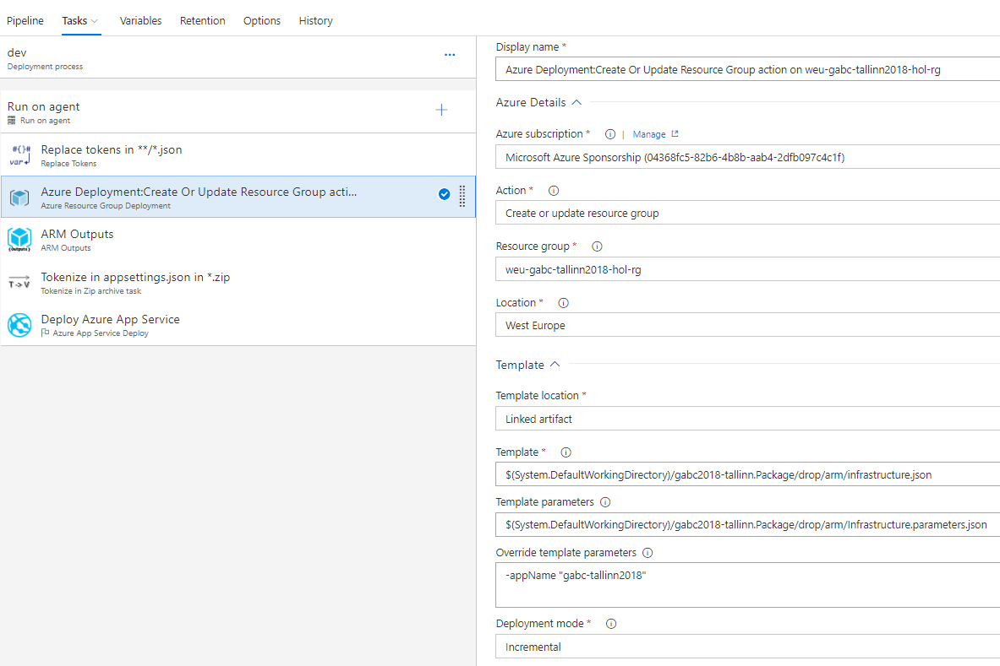
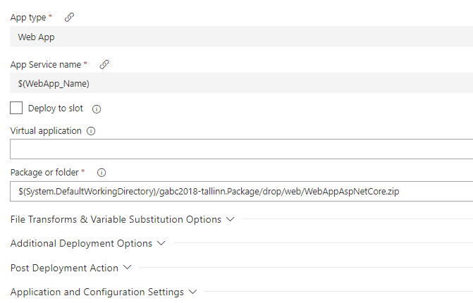

# Goal
Automate deployment to Azure using VSTS Build/Release pipelines.


# Setup Build Pipeline

# Requirements
Using the VSTS account that was setup in the previous step
As a base project use solution found in folder Solution2.


# Setup Build definition
Login to your VSTS account. Go to your project and choose Builds from the top menu. Open Build definition that was created in Step 6. Add/Remove Build Tasks according to the picture below. For the verion assemblies task, you need to install VSTS extension from the market place called `Manifest Versioning Build Tasks`.



Now, lets configure the build tasks.
Click on the 'Version Assemblies' task give it a 'Display name'. Add Source Folder `$(Build.Sources)` and version Number `$(Build.BuildNumber)`.



Because the Version Assemly is using `$(Build.BuildNumber)` we need to modify how that is generated. Go to Variables,
 add new Variable `ApplicationVersion` and add value like `1.0.0`. Now go to Options and modify Build number Format with the following `$(ApplicationVersion)$(rev:.r)`


Next click on Build Solution task and lets do some modifications there. Replace the MSBuild Arguments with following

```json

/p:DeployOnBuild=true /p:SkipInvalidConfigurations=true /p:PackageLocation="$(build.artifactstagingdirectory)\drop\web" /p:WebPublishMethod=Package

```


Move on to Copy Files task and give this task a display name, choose the the Source Folder where the ARM files are.
Add Target folder `$(build.artifactstagingdirectory)\drop\arm`



Open Publish Artifact task add a Display name, set Path to publish `$(build.artifactstagingdirectory)\drop`, this where the Artifact will be published.




Now Let move on to Release Pipeline

## Setup Release pipeline

Create a new release definition. Click on Artifact and fill information. Example below:



Under Artifact click on the lightning bolt icon and choose `Continuous deployment trigger` to be enabled.

Add environment and give it a name.
Next we will setup the Tasks the Release pipeline will run.

Add Tasks that are shown on the figure below.



Now we need to configure those tasks.

Firstly configure the Replace Tokens tasks. Give it a Display name and change Target files to pick up `**/*.json` files.
Next up is Azure Resource Group Deployment. 
Follow the provided figure to configure the release task at hand.



Continue with ARM Outputs task. Give it a Display name, choose Azure Connection type which should  be Azure Resource Manager. Choose your active Azure subscription and the resource group you created in previous step.

Last but not least lets configure Tokenize in zip archive task. Give it a display name, choose the path where the Build drops the deployment package. Add filter what kind of archive should be handled. Also provide what the configuration file name where the tokens are. Add/change the token prefix, in this example this should `__` and same for the sufix.



Lastly lets configure Azure App Service Deploy. 
Here we need to add there the package is that we want to deploy. This is defined in the build setep where the package is droped. for example: `$(System.DefaultWorkingDirectory)/gabc2018-tallinn.Package/drop/web/WebAppAspNetCore.zip`

One last thing we need to add Variable that the token replacer are using, lets add those lastly.
Follow the figure below.

[Release variables](./Media/ReleaseVariables.PNG)


Save the definition.

Now we should be able to start the build, after build step is finished the release is triggered automatically and your application will be deployed to azure.

# Bonus Goal
Automate the creation of the resources required by the application in Azure using Infrastructure as Code (IaC) using Visual Studio Resource Group project. For doing that, we'll start from an empty resource group template project in Visual Studio and add to it to cover all the Azure resources found in the previous steps.

# Requirements
* Azure PowerShell v3.7.0 or later. Get it [here](https://github.com/Azure/azure-powershell/releases/tag/v3.7.0-March2017).

# Reference
* https://docs.microsoft.com/en-us/azure/azure-resource-manager/resource-group-overview
* https://docs.microsoft.com/en-us/azure/azure-resource-manager/resource-manager-create-first-template
* https://docs.microsoft.com/en-us/azure/azure-resource-manager/vs-azure-tools-resource-groups-deployment-projects-create-deploy
* https://docs.microsoft.com/en-us/cli/azure/
* https://docs.microsoft.com/en-us/powershell/azure/overview

# Let's code!
## Login in to Azure and select the right subscription

- Open a PowerShell window
  - Change the directory to the DevOps step directory. `cd '{RepositoryPath}\2017\Step 7 - DevOps using ARM\Solutions\Deployment'`
  - `Login-AzureRmAccount`
  - `Select-AzureRmSubscription -Subscription {SubscriptionId}`

**!! You could find your '{SubscriptionId}' on the Azure portal on any "Overview" blade of the Azure resources you deployed earlier with this lab.**

The goal of the steps below is to copy/paste snippets from the folder `{RepositoryPath}\2017\Step 7 - DevOps using ARM\Code snippets` into the `{RepositoryPath}\2017\Step 7 - DevOps using ARM\Solutions\Deployment\azuredeploy.json` file.

## Add Azure Web App and App Service Plan

- Open the file `1-parameters.json` and copy/paste the content into the `parameters` section of the `azuredeploy.json` file.
- Open the file `1-variables.json` and copy/paste the content into the `variables` section of the `azuredeploy.json` file.
- Open the file `1-resources.json` and copy/paste the content into the `resources` section of the `azuredeploy.json` file.
- Save the `azuredeploy.json` template file and call `Deploy-AzureResourceGroup.ps1` in your PowerShell window.

**Just in case, you could find what the final `azuredeploy.json` file should look like at this stage by opening the `azuredeploy-1.final.json` file**


## Add Application Insights 

- Open the file `2-variables.json` and copy/paste the content into the `variables` section of the `azuredeploy.json` file (by adding it after the `webApp` variable).
- Open the file `2-resources.json` and copy/paste the content into the `resources` section of the `azuredeploy.json` file (by replacing the whole `WebApp` resource).

    **!! Take great care of replacing the whole `WebApp` resource with the new snippet content.**

- Save the `azuredeploy.json` template file and call `Deploy-AzureResourceGroup.ps1`

**Just in case, you could find what the final `azuredeploy.json` file should look like at this stage by opening the `azuredeploy-2.final.json` file**


To conclude this deployments, in the Azure portal, check out the Azure resources you just deployed and verify the **Deployments** blade of your resource group and see what happened.

# Bonus

- In Visual Studio, you could use the **JSON Outline** View to edit your azuredeploy.json ARM Template --> it's a graphical editor to add basic resources.
- In the Azure portal, go to your resource group just deployed and click on the **Locks** blade. Here add a `DoNotDelete` lock (**Lock type** = `Delete`). It's one of the good practice to protect your Azure resources, especially for Production. Don't forget you could automate this by PowerShell for example ;)

# End
